**案卷号**   
------------ ----------
**日期**   2021.3.6

<h3 style="padding: 1em 0em;">＜到云＞</h3>

**移动端需求文档**

|||
|:--|:--|
| **作 者:** | 黄中政 黄田箐 郭新共 李典源 |
| **完成日期:** | |
| **修改情况记录** | |


|  版本号  | 修改批准人  | 修改人 |  安装日期  | 签收人 |
|:--: | :--: | :--: | :--: | :--: |
| v0.1 | | 黄中政 | |
                                            

## **1 引言**

### **1.1 编写目的**

随着互联网的快速发展，智能手机功能日益完善，许多便民服务逐渐走进我们的生活。对于学校来说，最需要提高效率的地方就是课堂，得益于移动学习的兴起，越来越多的老师和学生认识到了其必要性和重要性。设计该产品正是为了满足师生的需求，提高课堂资源利用率，提升学习便捷性。

### **1.2 范围**

该产品的名称为"到云"，将设计一个基于移动端APP和web客户端的教学管理系统。该系统将老师在课堂上的各种动作尽可能的转移到手机上，例如发布签到，发布作业，批改作业，课堂提问等；该系统将学生在课堂上的各种动作尽可能的转移到手机上，例如课堂签到，提交作业，回答提问等。"到云"能够让老师和学生更加轻松的上课，最终减少课堂上的时间浪费。

### **1.3 定义**

APP：application，应用程序

web：World Wide web，全球广域网

## **2 项目概述**

### **2.1 产品描述**

随着社会的进步和经济的发展，我们国家广大人民的生活水平也随之提升。众所周知，经济的发展就需要技术的不断革新，所以在经历过数次工业革命之后，技术的进一步提升就需要信息技术来辅佐甚至指引方向。现在的社会是一个信息社会，人们的日常生活中无时无刻不在发生着信息的传递。这在课堂活动当中也不会例外，老师与学生之间的信息交互行为有很多，如签到，课后提问等等，这些都需要高效率的信息传递。对于老师一方来说，签到信息的记录和管理是一项复杂而又必需的工作，不同课程的不同学生进行签到，以及不同时间发起的签到。而对于学生一方来说，繁多的课程和签到等这一些类似的活动管理都需要一个合理而且高效的系统来帮助进行，所以签到系统的研发对于老师和学生都是大有好处的。

课堂签到是保证课堂质量以及学生出勤率的重要环节，对各个高校的日常教学来说是极其重要的。大多数高校当前使用的纸质签到方法取决于学生是否准时参与，并且在大多数情况下，无法解决学生代替他人进行签到的问题，这浪费了许多有价值的课堂时间。同时，在课堂上对所有学生进行点名的过程，对于学生以及教师而言，是无法预料能否起到督促作用的，并且这需要花费大量时间和精力，还不能保证准确性。随着课堂中学生人数每天的不断增加，传统的签到方法，即回应老师点名的效率越来越低。因此，通过将新时代的信息技术与互联网思维技术相结合来设计和实现基于微信小程序的签到系统变得越来越有意义，如果实现的话将使得在高校课堂中的签到活动变得很方便。

本软件产品为"到云"的移动端，另一组成部分为"到云"的后台管理系统。

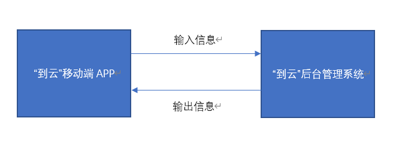

### **2.2 产品结构信息图**

#### 2.2.1 产品结构图

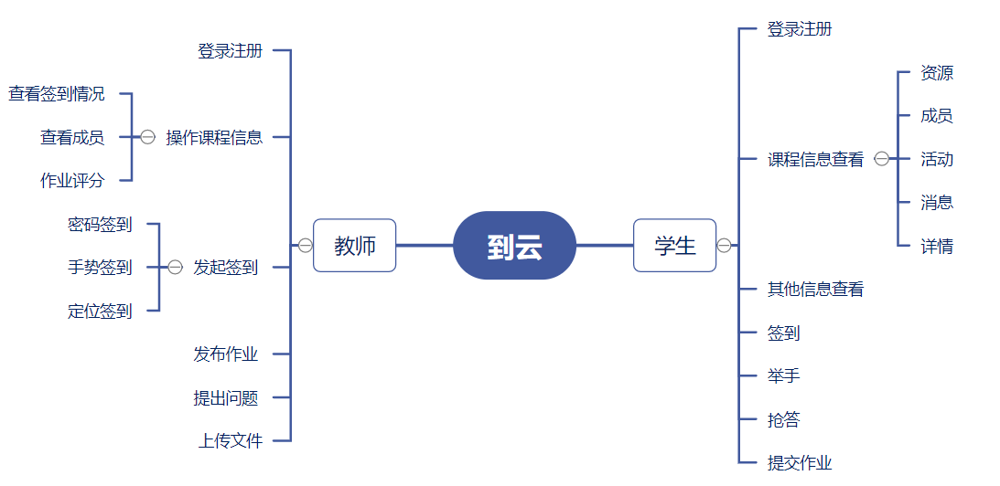

#### 2.2.2 产品信息图

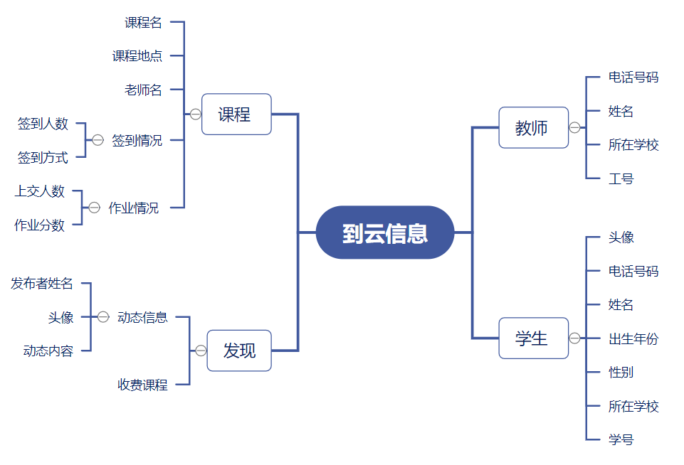

### **2.3 用户**

本软件的最终用户为教师和学生，易于接受新兴事物，由于课堂活动无时无刻不在发生，本软件的预期使用频度会极高，需要增大服务器负载。

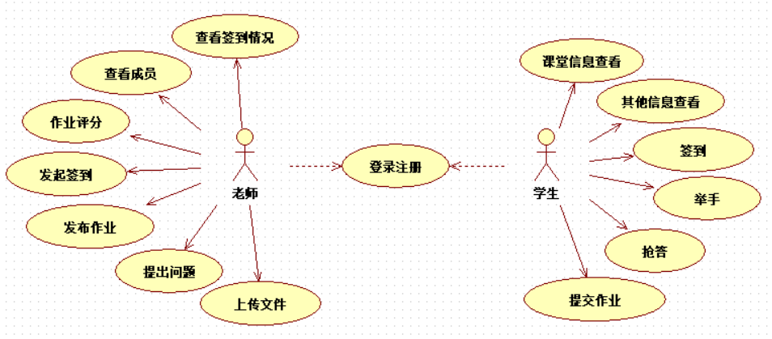

### **2.4 全局说明**

#### 2.4.1 功能权限

老师登录：可以使用所有功能。

老师未登录：只能看到未登录界面和注册按钮，不得使用其他功能。

学生登录：可以使用所有功能。

学生未登录：只能看到未登录界面和注册按钮，不得使用其他功能。

#### 2.4.2 键盘说明

点击验证码，签到密码输入框时弹出数字键盘；

点击其他输入框弹出字母键盘。

#### 2.4.3 异常说明

##### 被其他活动打断：

| 接到电话 | 返回原来界面 |
|:--|:--|
|  APP闪退              | 回到首页 |
|  接到微信/QQ/短信等   | 返回原来界面 |

## 3 具体需求

### 3.1 功能需求

#### 3.1.1 登录


| **功能描述** | **用户登录** |
|:--|:--|
| **优先级**        | 高                                              |
| **输入/前置条件** | 打开到云APP后就可以跳转到该页面                 |
| **基本事件流**    | 1. APP显示登录表单页面，表单中包含文本框:输入手机号码，页面中包含注册和忘记密码按钮<br/> 2. 用户输入11位手机号码，输入密码/选择验证码登录，获取验证码并输入<br/> 3. 点击登录按钮，进行登录</br>4. 登录成功，进入APP的查看班课页面|
| **异常流程**      | 1. 用户输入的手机号非法，弹出"请输入正确的手机号码"提示文本，2秒后消失，用户重新操作基本事件流<br/> 2. 用户输入密码错误，弹出"密码或手机号输入错误，请重新输入"提示文本，2秒后消失，用户重新操作基本事件流<br/>3. 累计输错3次密码，弹出提示文本框"您已输错3次密码，请尝试找回密码"<br/> 4. 点击登录后，后台未检测出该手机号注册的信息，弹出"该用户还未注册，请先注册 |
| **输出/后置条件** | 登录成功，进入APP查看班课页面/登录失败，重新登录  |
| **限制条件**      | 1. 号码输入必须为11位，后方显示绿色"√"<br/> 2. 密码输入必须为6位以上，后方显示绿色"√"，验证码输入需要无误.必须满足以上2点，才可以点击登录 |

**页面原型图**

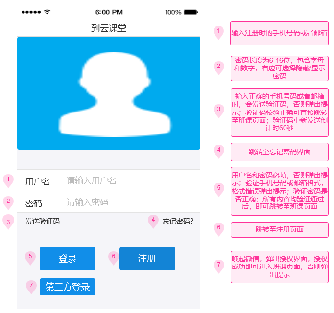


#### **3.1.2 注册**

+-------------------+-------------------------------------------------+
| **功能描述**      | **用户注册**                                    |
+===================+=================================================+
| **优先级**        | 高                                              |
+-------------------+-------------------------------------------------+
| **输入/前置条件** | 打开到云后点击注册按钮可以跳转到该页面          |
+-------------------+-------------------------------------------------+
| **基本事件流**    | 1.APP显示注册表单页面，表单中包含文本框:输入    |
|                   | 手机号码，邮箱和身份，页面中包含退出当前页面的  |
|                   | 按钮2.用户输入11位手机号码，输入密码/选择验证码 |
|                   | 注册，获取验证码并输入3.点击注册按钮，进行注册  |
|                   | 4.注册成功，进入APP首页                         |
+-------------------+-------------------------------------------------+
| **异常流程**      | 1.用户输入的手机号非法，弹出"请输入正确的手     |
|                   | 机号码"提示文本，2秒后消失，用户重新操作基本事  |
|                   | 件流22.用户输入密码不符合规范，弹出"密码或手机  |
|                   | 号不符合格式，请重新输入"提示文本，2秒后消失，  |
|                   | 用户重新操作基本事件流23.身份选择为教师或者学生 |
+-------------------+-------------------------------------------------+
| **输出/后置条件** | 注册成功，返回APP首页                           |
+-------------------+-------------------------------------------------+
| **限制条件**      | 1.号码输入必须为11位                            |
|                   |                                                 |
|                   | 2.密码输入必须为6-16位，验                      |
|                   | 证码输入为4位3.必须满足以上2点，才可以点击登录  |
+-------------------+-------------------------------------------------+

**页面原型图**

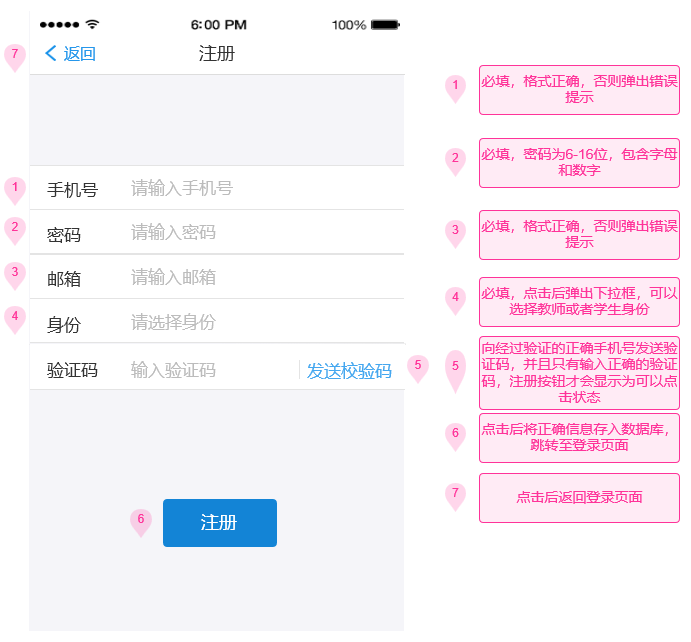

#### **3.1.3 忘记密码**

+-------------------+-------------------------------------------------+
| **功能描述**      | **用户登录**                                    |
+===================+=================================================+
| **优先级**        | 中                                              |
+-------------------+-------------------------------------------------+
| **输入/前置条件** | 点击忘记                                        |
|                   | 密码按钮可以跳转到该页面，或者输错三次密码跳转  |
+-------------------+-------------------------------------------------+
| **基本事件流**    | 1.APP显示表单页面，表单中包含文本框:输入手机    |
|                   | 号码，新密码，验证码，页面中包含退出当前页面的  |
|                   | 按钮2.用户输入11位手机号码，输入密码/选择验证码 |
|                   | 登录，获取验证码并输入3.点击登录按钮，进行登录  |
|                   |                                                 |
|                   | 4.登录成功，进入APP首页                         |
+-------------------+-------------------------------------------------+
| **异常流程**      | 1.用户输入的手                                  |
|                   | 机号非法，弹出"请输入正确的手机号码"提示文本，  |
|                   | 2秒后消失，用户重新操作基本事件流22.用户输入手  |
|                   | 机号或密码格式错误，弹出"密码或手机号输入错误， |
|                   | 请重新输入"提示文本，2秒后消失，用户重新操作基  |
|                   | 本事件流23.只有正确输入验证码才能够成功修改密码 |
+-------------------+-------------------------------------------------+
| **输出/后置条件** | 修改成功，进入APP首页                           |
+-------------------+-------------------------------------------------+
| **限制条件**      | 1.号码输入必须为11位                            |
|                   |                                                 |
|                   | 2.密码输入必须为6-16位，验                      |
|                   | 证码输入为4位3.必须满足以上2点，才可以点击登录  |
+-------------------+-------------------------------------------------+

**页面原型图**

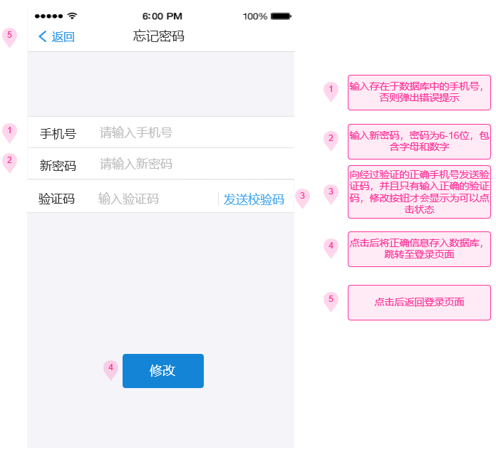

#### **3.1.4 查看班课（教师）**

  **功能描述**        **用户登录**
  ------------------- -----------------------------------------------------------------------------------------------------
  **优先级**          高
  **输入/前置条件**   登录成功，且从数据库读取到该账号身份为教师，即显示该页面
  **基本事件流**      1.APP显示搜索框，课程列表，右上角的加号点击后会弹出下拉框，该框有创建班课，加入班课，扫一扫三个功能
  **异常流程**        1.网络错误则出现提示
  **输出/后置条件**   点击对应按钮进入对应页面
  **限制条件**        无

**页面原型图**

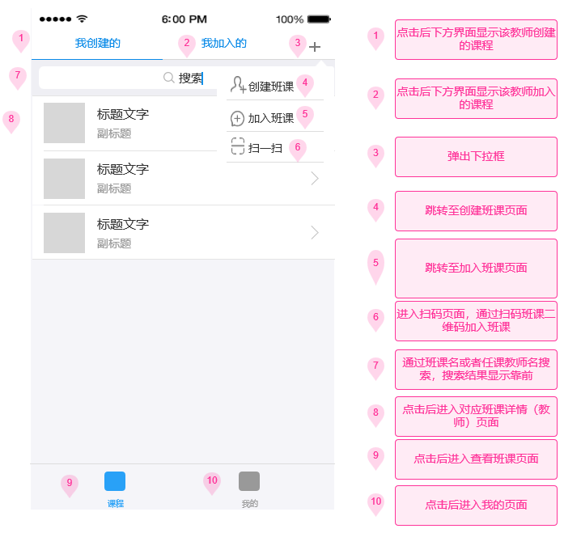

#### **3.1.5 创建班课**

+-------------------+-------------------------------------------------+
| **功能描述**      | **用户登录**                                    |
+===================+=================================================+
| **优先级**        | 高                                              |
+-------------------+-------------------------------------------------+
| **输入/前置条件** | 进入到查看班课页面后，只有教师会                |
|                   | 显示创建班课按钮，点击创建班课按钮跳转至该页面  |
+-------------------+-------------------------------------------------+
| **基本事件流**    | 1.APP显                                         |
|                   | 示创建班课表单页面，表单中包含文本框:输入课程名 |
|                   | ，任课教师名，上课时间，进入密码，页面中包含退  |
|                   | 出当前页面的按钮2.用户输入课程名，任课教师名，  |
|                   | 上课时间，进入密码3.点击创建按钮，进行班课创建  |
|                   |                                                 |
|                   | 4.创建成功，进入创建班课页面，且显示该班课      |
+-------------------+-------------------------------------------------+
| **异常流程**      | 1.用户输入的课程名非法，弹出"请输入正确的课程名 |
|                   | "提示文本，2秒后消失，用户重新操作基本事件流22. |
|                   | 用户输入任课教师错误，弹出"请输入正确的任课教师 |
|                   | 名"提示文本，2秒后消失，用户重新操作基本事件流2 |
+-------------------+-------------------------------------------------+
| **输出/后置条件** | 创建成功，进入查看班课页面                      |
+-------------------+-------------------------------------------------+
| **限制条件**      | 见图                                            |
+-------------------+-------------------------------------------------+

**页面原型图**

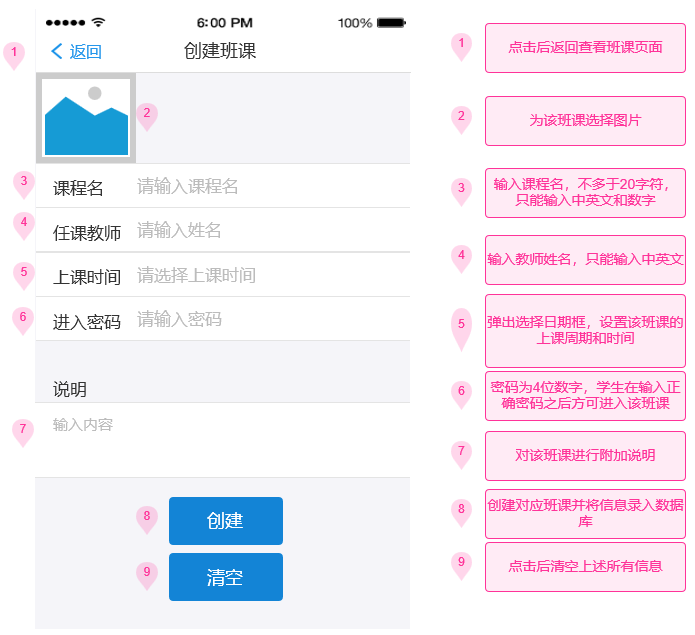

#### **3.1.6 加入班课**

+-------------------+-------------------------------------------------+
| **功能描述**      | **用户登录**                                    |
+===================+=================================================+
| **优先级**        | 中                                              |
+-------------------+-------------------------------------------------+
| **输入/前置条件** | 进入                                            |
|                   | 到查看班课页面后，点击加入班课按钮跳转至该页面  |
+-------------------+-------------------------------------------------+
| **基本事件流**    | 1.APP显示加入班课表单页面，表单中               |
|                   | 包含文本框:输入课程名，进入密码，页面中包含退出 |
|                   | 当前页面的按钮2.用户输入课程名，进入密码3.点击  |
|                   | 进入按钮，进行加入班课，密码正确才能够进入课程  |
|                   |                                                 |
|                   | 4.加入成功，进入班课详情页面，且显示该班课信息  |
+-------------------+-------------------------------------------------+
| **异常流程**      | 1.用户输入的课程名非法，弹出"请输入正确         |
|                   | 的课程名"提示文本，2秒后消失，用户重新操作基本  |
|                   | 事件流22.用户输入密码错误，弹出"请输入正确的密  |
|                   | 码"提示文本，2秒后消失，用户重新操作基本事件流2 |
+-------------------+-------------------------------------------------+
| **输出/后置条件** | 加入成功，进入班课详情页面                      |
+-------------------+-------------------------------------------------+
| **限制条件**      | 见图                                            |
+-------------------+-------------------------------------------------+

**页面原型图**

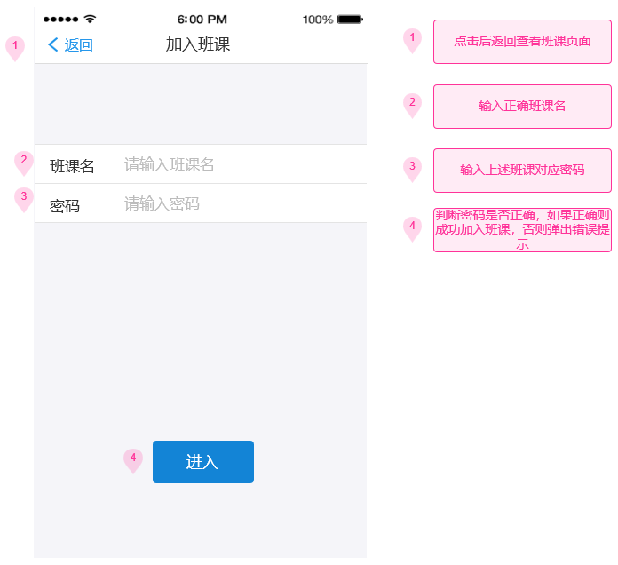

#### **3.1.7 班课详情（教师）**

  **功能描述**        **用户登录**
  ------------------- ----------------------------------------------------------------------------------------------------------------------------------------------------------------------------------------------------------------
  **优先级**          中
  **输入/前置条件**   点击所需要班课且用户身份为教师可以跳转到该页面
  **基本事件流**      1.可以修改班课信息，如任课教师名，上课时间2.打开允许加入按钮，该班课才可以加入，否则即使正确输入密码也无法加入3.点查看签到情况 4.点击发起签到即可进入发起签到页面 5.生成二维码即可让其他用户扫描二维码加入班课
  **异常流程**        1.网络错误则出现提示
  **输出/后置条件**   发起签到成功，进入发起签到页面
  **限制条件**        见图

**页面原型图**

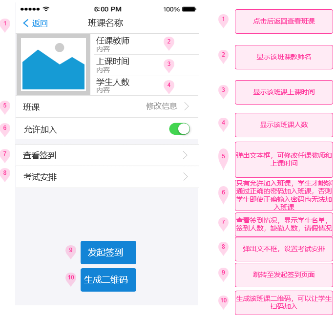

#### **3.1.8 发起签到**

+-------------------+-------------------------------------------------+
| **功能描述**      | **用户登录**                                    |
+===================+=================================================+
| **优先级**        | 高                                              |
+-------------------+-------------------------------------------------+
| **输入/前置条件** | 在                                              |
|                   | 班课详情页面，点击发起签到页面即可跳转至该页面  |
+-------------------+-------------------------------------------------+
| **基本事件流**    | 1.APP显示签到表单页面，表单中包含文             |
|                   | 本框:输入签到密码，选择签到时间，签到地点，还可 |
|                   | 选择签到手势，页面中包含退出当前页面的按钮2.用  |
|                   | 户选择上述签到方式的一种或者多种，每一种方式增  |
|                   | 加各自显示隐藏按钮3.点击开始按钮，开始进行签到  |
|                   |                                                 |
|                   | 4.发起签到成功，进入班课详情页面                |
+-------------------+-------------------------------------------------+
| **异常流程**      | 1.网络错误则出现                                |
|                   | 提示，弹出"请等待网络连接"提示文本，2秒后消失， |
|                   | 用户重新操作基本事件流22.用户输入密码不符合格式 |
|                   | ，弹出"密码格式错误，请重新输入"提示文本，2秒后 |
|                   | 消失，用户重新操作基本事件流23.点击发起签到，后 |
|                   | 台检测出该课程上次签到还未结束，则发起签到失败  |
+-------------------+-------------------------------------------------+
| **输出/后置条件** | 发起签到成功，可在班课详情页面查看签到情况      |
+-------------------+-------------------------------------------------+
| **限制条件**      | 1.密码输入为4位数字                             |
|                   |                                                 |
|                   | 2.手势签到经过九宫格个数需要大于等于2           |
+-------------------+-------------------------------------------------+

**页面原型图**

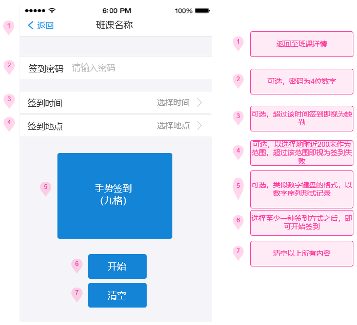

#### **3.1.9 查看班课（学生）**

  **功能描述**        **用户登录**
  ------------------- -------------------------------------------------------------------------------------------
  **优先级**          高
  **输入/前置条件**   登录成功，且从数据库读取到该账号身份为学生，即显示该页面
  **基本事件流**      1.APP显示搜索框，课程列表，右上角的加号点击后会弹出下拉框，该框有加入班课，扫一扫两个功能
  **异常流程**        1.网络错误则出现提示
  **输出/后置条件**   点击对应按钮进入对应页面
  **限制条件**        无

**页面原型图**

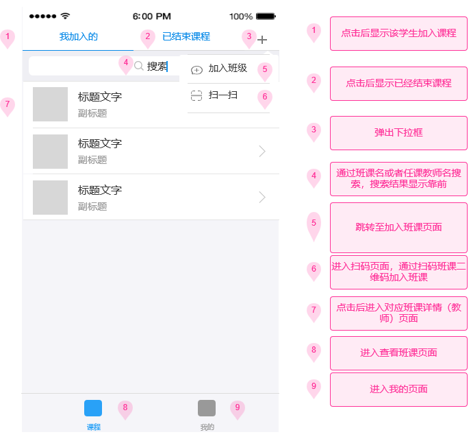

#### **3.1.10 班课详情（学生）**

  **功能描述**        **用户登录**
  ------------------- --------------------------------------------------------------------------------------------------------------------------------------------------------------------------------------------------------------------------------------------
  **优先级**          中
  **输入/前置条件**   点击所需要班课且用户身份为学生可以跳转到该页面
  **基本事件流**      1.可以查看班课信息，如任课教师名，上课时间2.打开课程结束按钮，该班课即视为结束，会自动加入查看班课页面中的已结束课程栏目中3.点查看签到，可查看该用户在该课程签到情况 4.点击开始签到即可进入签到页面 5.点击退出课程，会出现是否确认操作提示
  **异常流程**        1.网络错误则出现提示
  **输出/后置条件**   签到成功，返回班课详情页面
  **限制条件**        见图

**页面原型图**

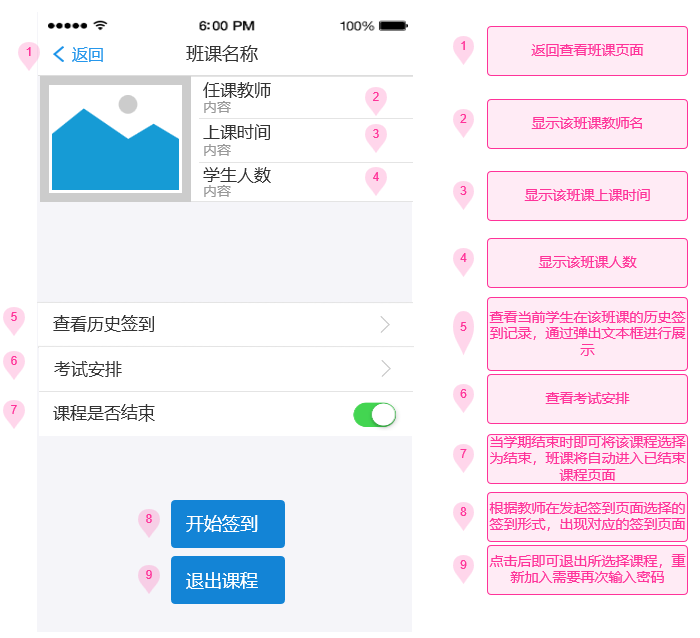

#### **3.1.11 我的页面**

  **功能描述**        **用户登录**
  ------------------- ---------------------------------------------------------------------------
  **优先级**          高
  **输入/前置条件**   登录成功，点击我的按钮
  **基本事件流**      1.修改个人信息2.查看经验值3.查看该用户历史签到记录 4.分享该APP 5.退出登录
  **异常流程**        1.用户首次登录该APP，进入该页面后将会自动进入修改信息页面
  **输出/后置条件**   无
  **限制条件**        无

**页面原型图**

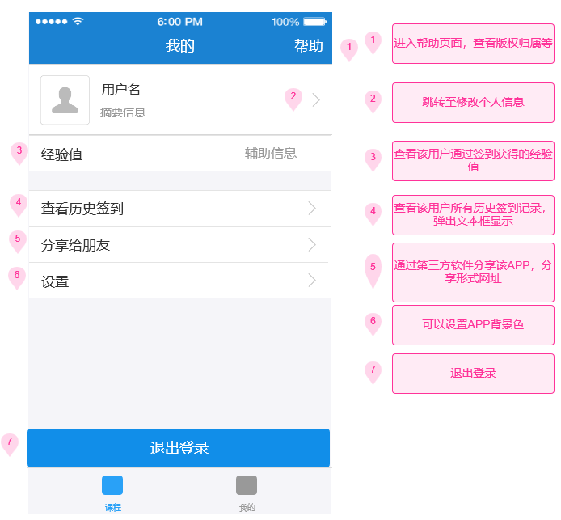

#### **3.1.12 修改信息**

  **功能描述**        **用户登录**
  ------------------- --------------------------------------------------------------------------------------------------------------------
  **优先级**          中
  **输入/前置条件**   在我的页面点击修改信息可以跳转到该页面，或者在首次登录之后未输入过信息则自动跳转到该页面
  **基本事件流**      修改个人信息
  **异常流程**        1.用户输入的姓名或昵称非法，弹出"请输入正确的姓名"提示文本，2秒后消失，用户重新操作基本事件流22.网络错误则出现提示
  **输出/后置条件**   修改成功，进入我的页面
  **限制条件**        见图

**页面原型图**

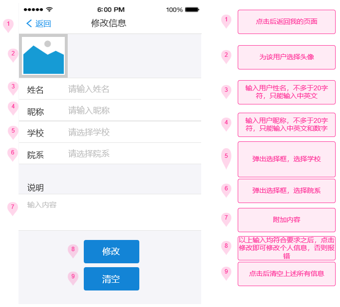

### **3.2 外部接口需求（未写）**

#### **3.2.1 用户接口**

提供用户使用软件产品时的接口需求。例如，如果系统的用户通过显示终端进行操作，就必须指定如下要求：

a.  对屏幕格式的要求；

b.  报表或菜单的页面打印格式和内容；

c.  输入输出的相对时间；

d.  程序功能键的可用性。

#### **3.2.2 硬件接口**

要指出软件产品和系统硬部件之间每一个接口的逻辑特点。还可能包括如下事宜：支撑什么样的设备，如何支撑这些设备，有何约定。

#### **3.2.3 软件接口**

在此要指定需使用的其他软件产品（例如，数据管理系统、操作系统或数学软件包），以及同其他应用系统之间的接口。对每一个所需的软件产品，要提供如下内容：

a.  名字；

b.  助记符；

c.  规格说明号；

d.  版本号；

e.  来源。

对于每一个接口，这部分应说明与软件产品相关的接口软件的目的，并根据信息的内容和格式定义接口，但不必详细描述任何已有完整文件的接口，只要引用定义该接口的文件即可。

#### **3.2.4 通信接口**

指定各种通信接口。例如，局部网络的协议等等。

### **3.3 性能需求**

从整体来说，本条应具体说明软件、或人与软件交互的静态或动态数值需求。

A.  静态数值需求可能包括：

```{=html}
<!-- -->
```
1)  支持的终端数；

2)  支持并行操作的用户数；

3)  处理的文卷和记录数；

4)  表和文卷的大小。

```{=html}
<!-- -->
```
B.  动态数值需求可能包括：欲处理的事务和任务的数量，以及在正常情况下和峰值工作条件下一定时间周期中处理的数据总量。

所有这些需求都必须用可以度量的术语来叙述。例如，95％的事务必须在小于1s时间内处理完，不然，操作员将不等待处理的完成。

### **3.4 设计约束**

设计约束受其他标准、硬件限制等方面的影响。

#### **3.4.1 其他标准的约束**

本项将指定由现有的标准或规则派生的要求。例如：

a.  报表格式；

b.  数据命名；

c.  财务处理；

d.  审计追踪，等等。

#### **3.4.2 硬件的限制**

本项包括在各种硬件约束下运行的软件要求，例如，应该包括：

a.  硬件配置的特点（接口数，指令系统等）；

b.  内存储器和辅助存储器的容量。

### **3.5 属性**

在软件的需求之中有若干个属性，以下指出其中的几个（注意：对这些决不应理解为是一个完整的清单）。

#### **3.5.1 可用性**

可以指定一些因素，如检查点、恢复和再启动等，以保证整个系统有一个确定的可用性级别。

#### **3.5.2 安全性**

指的是保护软件的要素，以防止各种非法的访问、使用、修改、破坏或者泄密。这个领域的具体需求必须包括：

a.  利用可靠的密码技术；

b.  掌握特定的记录或历史数据集；

c.  给不同的模块分配不同的功能；

d.  限定一个程序中某些区域的通信；

e.  计算临界值的检查和。

#### **3.5.3 可维护性**

规定若干需求以确保软件是可维护的。例如：

a.  软件模块所需要的特殊的耦合矩阵；

b.  为微型装置指定特殊的数据＼程序分割要求。

#### **3.5.4 可转移 ＼转换性**

规定把软件从一种环境移植到另一种环境所要求的用户程序，用户接口兼容方面的约束等等。

#### **3.5.5 警告**

指定所需属性十分重要，它使得人们能用规定的方法去进行客观的验证。

### **3.6 其他需求**

根据软件和用户组织的特性等，某些需求放在下面各项中描述。

#### **3.6.1 数据库**

本项对作为产品的一部分进行开发的数据库规定一些需求，它们可能包括：

a.  在功能需求中标识的信息类别；

b.  使用的频率；

c.  存取能力；

d.  数据元素和文卷描述符；

e.  数据元素、记录和文卷的关系；

f.  静态和动态的组织；

g.  数据保存要求。

注：如果使用一个现有的数据库包，这个包应在"软件接口"中命名，并在那里详细说明其用法。

#### **3.6.2 操作**

这里说明用户要求的常规的和特殊的操作。

A.  在用户组织之中各种方式的操作。例如，用户初始化操作；

B.  交互作用操作的周期和无人操作的周期；

C.  数据处理运行功能；

D.  后援和恢复操作。

注：这里的内容有时是用户接口的一部分。

#### **3.6.3 场合适应性需求**

这里包括：

a.  对给定场合或相关任务或操作方式的任何数据或初始化顺序的需求进行定义。例如，栅值，安全界限等等。

b.  指出场合或相关任务为特点，这里可以被修改以使软件适合特殊配制的要求。
