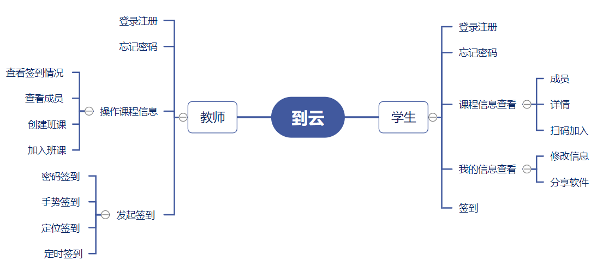
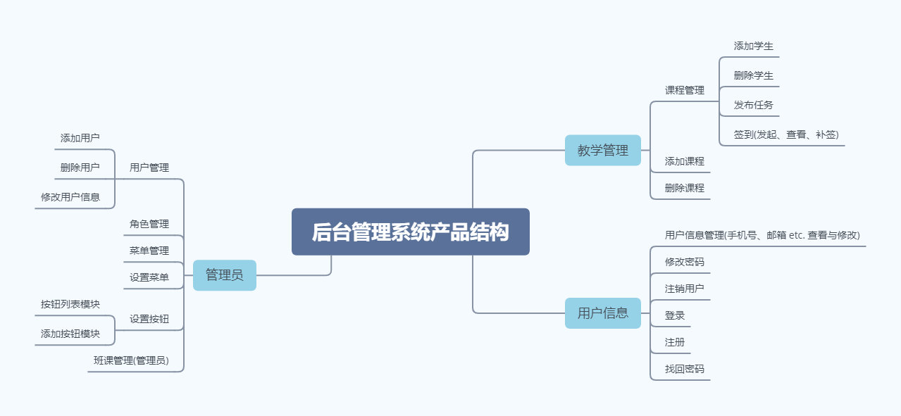
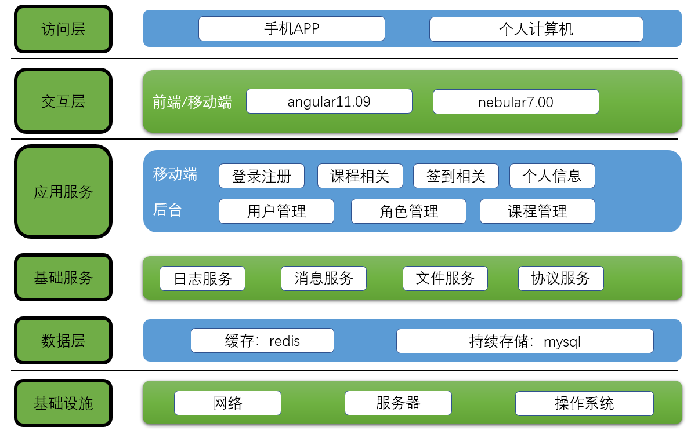

#  到云项目总结文档

# 1.小组成员

|  小组分工          |  姓名                  | 贡献度 |
| :-- | :-- | :-- | 
|  项目经理           | 黄中政（18858703573）  | |
|  移动端开发工程师   | 黄田箐                 | |
  前端开发工程师     李典源                    | |
  后端开发工程师     郭新共                    | |

# 2.产品图

## 2.1 移动端产品结构图

## 2.2 后台产品结构图

## 2.2 产品架构图

# 3.项目描述

## 3.1 后台管理系统：Java+jdk1.8+springboot2.4.3

Java：Java最早是由SUN公司（已被Oracle收购）的詹姆斯·高斯林（高司令，人称Java之父）在上个世纪90年代初开发的一种编程语言，最初被命名为Oak，目标是针对小型家电设备的嵌入式应用，结果市场没啥反响。谁料到互联网的崛起，让Oak重新焕发了生机，于是SUN公司改造了Oak，在1995年以Java的名称正式发布，原因是Oak已经被人注册了，因此SUN注册了Java这个商标。随着互联网的高速发展，Java逐渐成为最重要的网络编程语言。

Java介于编译型语言和解释型语言之间。编译型语言如C、C++，代码是直接编译成机器码执行，但是不同的平台（x86、ARM等）CPU的指令集不同，因此，需要编译出每一种平台的对应机器码。解释型语言如Python、Ruby没有这个问题，可以由解释器直接加载源码然后运行，代价是运行效率太低。而Java是将代码编译成一种"字节码"，它类似于抽象的CPU指令，然后，针对不同平台编写虚拟机，不同平台的虚拟机负责加载字节码并执行，这样就实现了"一次编写，到处运行"的效果。

Springboot：Spring框架是Java平台上的一种开源应用框架，提供具有控制反转特性的容器。尽管Spring框架自身对编程模型没有限制，但其在Java应用中的频繁使用让它备受青睐，以至于后来让它作为EJB（EnterpriseJavaBeans）模型的补充，甚至是替补。Spring框架为开发提供了一系列的解决方案，比如利用控制反转的核心特性，并通过依赖注入实现控制反转来实现管理对象生命周期容器化，利用面向切面编程进行声明式的事务管理，整合多种持久化技术管理数据访问，提供大量优秀的Web框架方便开发等等。Spring框架具有控制反转（IOC）特性，IOC旨在方便项目维护和测试，它提供了一种通过Java的反射机制对Java对象进行统一的配置和管理的方法。Spring框架利用容器管理对象的生命周期，容器可以通过扫描XML文件或类上特定Java注解来配置对象，开发者可以通过依赖查找或依赖注入来获得对象。

## 3.2数据库：mysql 5.7

Mysql：MySQL是一个关系型数据库管理系统，由瑞典MySQL AB 公司开发，属于
Oracle 旗下产品。MySQL 是最流行的关系型数据库管理系统之一，在 WEB
应用方面，MySQL是最好的 RDBMS (Relational Database Management
System，关系数据库管理系统) 应用软件之一。

MySQL是一种关系型数据库管理系统，关系数据库将数据保存在不同的表中，而不是将所有数据放在一个大仓库内，这样就增加了速度并提高了灵活性。

MySQL所使用的 SQL 语言是用于访问数据库的最常用标准化语言。MySQL
软件采用了双授权政策，分为社区版和商业版，由于其体积小、速度快、总体拥有成本低，尤其是开放源码这一特点，一般中小型网站的开发都选择
MySQL 作为网站数据库。

## 3.3移动端：ionic5+angular11.09+nodejs14.16.0

Ionic：ionic是基于Web技术应用HTML5、CSS3和
JavaScript技术进行智能设备APP开发的框架，具有很好的跨平台性能，被称为
Hybird
App框架，即混合模式的移动APP开发框架。ionic聚焦于感官和应用的Ui交互，它不是
Phone Gap或
Cordova的替代品，ionic只是在前端大幅度简化了APP开发。为了发挥ionic的完美功能，需要
AngularJS的配合，虽然可以继续使用
AngularJS的CSS内容，但会失去ionic提供的强大的交互、手势、动画等支持，因此在使用ionic时应避免使用其他CSS内容。ionic的最终目的是让基于HTML5开发本地智能设备APP的工作更加容易，这种APP被称为混合APP。

Angular：AngularJS诞生于2009年，由Misko Hevery
等人创建，后为Google所收购。是一款优秀的前端JS框架，已经被用于Google的多款产品当中。AngularJS有着诸多特性，最为核心的是：MVC（Model--view--controller）、模块化、自动化双向数据绑定、语义化标签、依赖注入等等。AngularJS
是一个 JavaScript框架。它是一个以 JavaScript 编写的库。它可通过
\<script\> 标签添加到HTML 页面。AngularJS 通过 指令 扩展了 HTML，且通过
表达式 绑定数据到 HTML。AngularJS 是以一个 JavaScript
文件形式发布的，可通过 script 标签添加到网页中。

Nodejs：Node.js发布于2009年5月，由Ryan Dahl开发，是一个基于Chrome
V8引擎的JavaScript运行环境，使用了一个事件驱动、非阻塞式I/O模型，让JavaScript
运行在服务端的开发平台，它让JavaScript成为与PHP、Python、Perl、Ruby等服务端语言平起平坐的脚本语言。

Node.js对一些特殊用例进行优化，提供替代的API，使得V8在非浏览器环境下运行得更好，V8引擎执行Javascript的速度非常快，性能非常好，基于Chrome
JavaScript运行时建立的平台，
用于方便地搭建响应速度快、易于扩展的网络应用。

## 3.4 Web端：angular11.09+nebular7.00

Nebular：<https://akveo.github.io/nebular/>

Angular：AngularJS诞生于2009年，由Misko Hevery
等人创建，后为Google所收购。是一款优秀的前端JS框架，已经被用于Google的多款产品当中。AngularJS有着诸多特性，最为核心的是：MVC（Model--view--controller）、模块化、自动化双向数据绑定、语义化标签、依赖注入等等。AngularJS
是一个 JavaScript框架。它是一个以 JavaScript 编写的库。它可通过
\<script\> 标签添加到HTML 页面。AngularJS 通过 指令 扩展了 HTML，且通过
表达式 绑定数据到 HTML。AngularJS 是以一个 JavaScript
文件形式发布的，可通过 script 标签添加到网页中。

## 3.5 部署环境：Ubuntu18.04.1+Tomcat9.0.5

Ubuntu：Ubuntu是一个以桌面应用为主的[Linux](https://baike.baidu.com/item/Linux/27050)操作系统，其名称来自非洲南部祖鲁语或豪萨语的"ubuntu\"一词，意思是"人性""我的存在是因为大家的存在\"，是非洲传统的一种价值观。Ubuntu基于[Debian](https://baike.baidu.com/item/Debian/748667)发行版和Gnome桌面环境，而从11.04版起，Ubuntu发行版放弃了[Gnome](https://baike.baidu.com/item/Gnome/5105879)桌面环境，改为Unity。从前人们认为Linux难以安装、难以使用，在Ubuntu出现后这些都成为了历史。Ubuntu也拥有庞大的社区力量，用户可以方便地从社区获得帮助。

Tomcat：Tomcat 服务器是一个免费的开放源代码的Web
应用服务器，属于轻量级应用服务器，在中小型系统和并发访问用户不是很多的场合下被普遍使用，是开发和调试JSP
程序的首选。

# 4.其他链接

GitHub地址： https://github.com/N1ckstrong/gongchengshijian

移动端文档：【腾讯文档】软件需求说明书 https://docs.qq.com/doc/DUkNlclJsVlhmVHZm

后台管理文档：【腾讯文档】后台需求说明书 https://docs.qq.com/doc/DUm5zdEJ2dFdIWWRx
